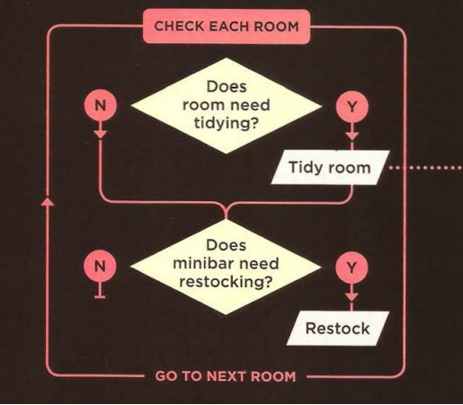

# JavaScript(JS) makes websites more attractive , intristing and user-friendlly
## first of all you have to learn *HTML&CSS*
it makes websites more attractive , intristing and user-friendlly by :
1-access contant 
2- modifying
3-specify a set of steps
4-responding to what the user does 

### For Examble SlideShows and Validating Forms
## the amazing thing in JS it allow to user to get immeditly the thing he need without reload the page 
## and the nice thing in **JS filter the information to get what you want in an  easier way 

## The DEf. of script its a set of steps of instruction to follow step by step 
## the JS makes the pages smarter by :
Expression , operation and arthimetical operation 